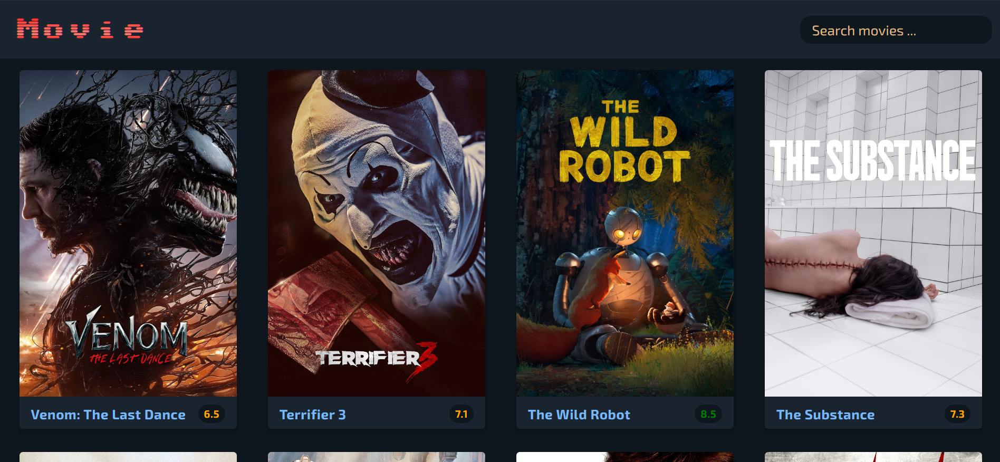
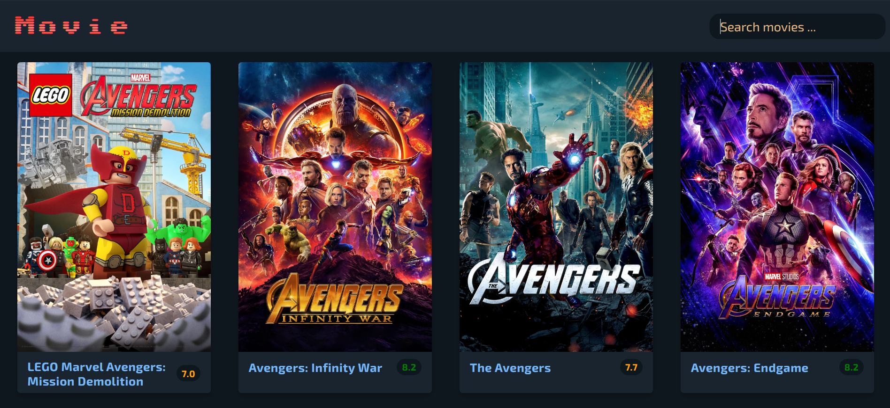

<h1>Udemig-MovieApp</h1>

# 🎬 BRK Movie

BRK Movie is a movie search application that lets users explore popular movies and search for specific titles.The app displays movies with posters, ratings, and overviews, giving users a seamless browsing and search experience.

## 📖 Table of Contents

- [Features](#-features)
- [Screenshots](#-screenshots)
- [Technologies Used](#-technologies-used)
- [Installation](#-installation)

---

## 🚀 Features

- **Display Popular Movies**: Shows trending movies on page load, sorted by popularity.
- **Movie Search**: Find specific movies by typing the title in the search bar.
- **Detailed Information**: Each movie card shows its title, poster, average rating, and a brief overview.
- **Dynamic Rating Colors**: Ratings are color-coded for easy identification:
  - Green for high ratings (8+)
  - Orange for moderate ratings (5-7.9)
  - Red for low ratings (below 5)

## 🎨 Screenshots


_Homepage displaying popular movies_


_Search results for specific movie queries_

## 🛠️ Technologies Used

- **HTML5** for the basic structure of the application
- **CSS3** for styling and layout
- **JavaScript** for application logic and DOM manipulation

## 📦 Installation

To get started, follow these steps:

1. **Clone this repository**:
   ```bash
   git clone https://github.com/your_username/BRK-Movie.git
   ```
